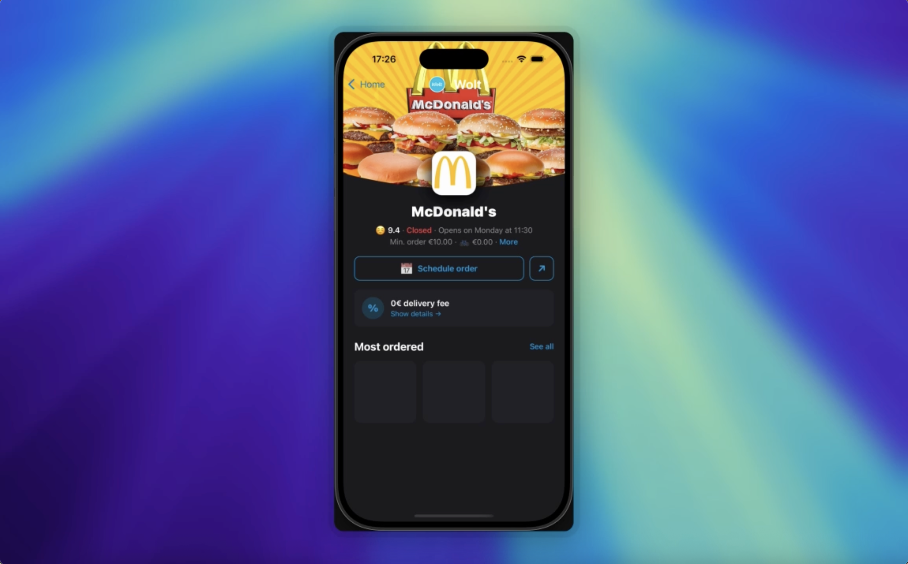
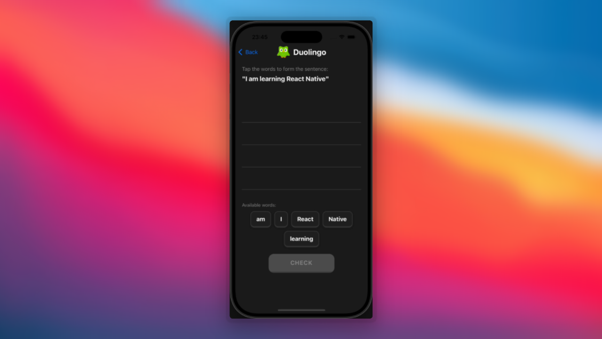

## Awesome mobile app animations

✨ A collection of animations from popular apps like youtube ✨

Built using react native, with the help of

- react-native-reanimated
- react-native-gesture-handler
- react-native-skia
- and other awesome packages

## Code

Code for all the examples are available inside the `/src` folder

## DEMOS

| App                                       | Preview                                                                                                    | Video                                                  | Code                                          |
| ----------------------------------------- | ---------------------------------------------------------------------------------------------------------- | ------------------------------------------------------ | --------------------------------------------- |
| **Wolt** — Frost creep like image loading |                    | [YouTube](https://youtu.be/cZBs7ur75Dk)                | [Source](./src/WoltShopLoading)               |
| **Duolingo** — Drag sort words            |                   | [YouTube](https://youtu.be/-KX4BDmUdN8)                | [Source](./src/DuoLingoDragSortWords)         |
| **Threads** — Pull-to-refresh             |                     | [YouTube](https://youtu.be/9Zi5wbfT-Mk)                | [Source](./src/ThreadsPullToRefresh)          |
| **Stocks** — Chart animation              |                                               | [YouTube](https://youtu.be/KC_Z-5sVTAU)                | [Source](./src/StocksChart)                   |
| **Youtube Music** — Swipe Bg Transition   |  | [YouTube](https://www.youtube.com/watch?v=u8-dyjjUIio) | [Source](./src/YoutubeMusicSwipeBgTransition) |

## How to run

1. Install dependencies

```bash
yarn install
```

2. Run the app

```bash
yarn start
```

## Hire me

[Adithya Viswamithiran](https://bit.ly/3qSe5BN)

Also refer to some of my work

- [reanimated-tab-view: A custom tab view component for react-native built using reanimated](https://github.com/adithyavis/reanimated-tab-view)
