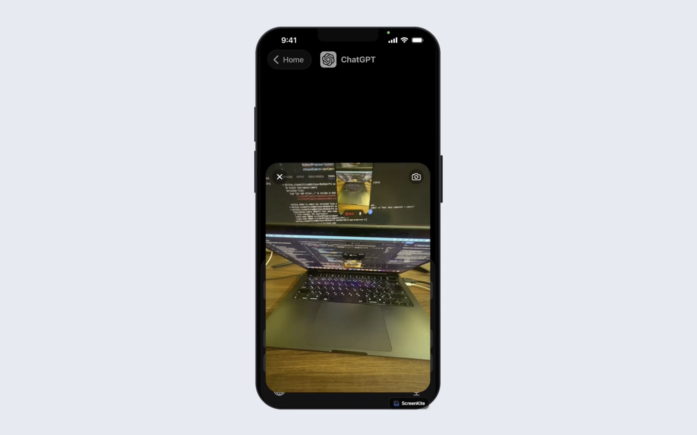

# ChatGPT Camera

Recreates ChatGPT's composer attachment flow: the `+` button grows into a menu that straddles the keyboard, and the Camera row morphs that menu into a live camera view.

## Features

- One menu morphs `+` -> menu -> camera, not a cross-fade between views
- Menu rests above the composer with the keyboard down, and centres on its top edge with it up
- Camera warmed up front, so the feed is already streaming when the menu expands

## Implementation Details

Built with `react-native-reanimated`, `react-native-keyboard-controller` (`OverKeyboardView`, keyboard height/progress), `@callstack/liquid-glass`, and `expo-camera`.

Two shared values drive it: `menu` takes the panel from the `+` to the menu, `cam` takes that menu to the camera. Both share a top-left anchor, so the expand reads as one container growing in place.

The preview is pinned at its final size and only fades in — the menu's `overflow: hidden` does the reveal. Resizing it per frame would re-run `layoutSubviews`, where expo-camera's `previewLayer.frame = bounds` starts a fresh implicit CoreAnimation each time, making the feed lag the container.

iOS only: liquid glass has no Android build, and CameraX's `SurfaceView` ignores the parent clipping.

## Key Components

- `Composer` - bottom pill and `+` button
- `Menu` - the morphing menu and camera layer
- `useComposerMenu` - shared values and overlay lifecycle

## DEMO

