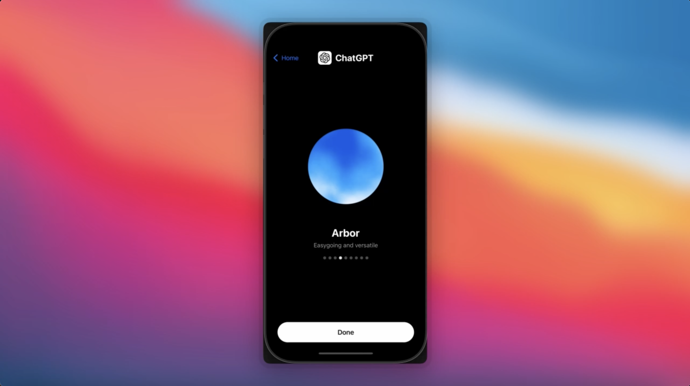

# ChatGPT Voice Profiles

This example recreates the fluid orb animation from ChatGPT's voice selection screen, where users swipe through voice profiles (Breeze, Juniper, Ember, etc.) each displaying an animated blue-white fluid orb.

## Features

- GPU-rendered fluid orb using a custom Skia SKSL fragment shader
- Dual-layer FBM noise advection for large, soft, organic fluid shapes
- Sparse fast-moving overlay layer for subtle wispy detail
- Boundary-aware fine detail that appears only at the white/blue transition zone
- Floating bob and breathing scale animation on the orb
- Swipe boost: speed and warp range increase on carousel page change, then settle
- Horizontal paging carousel with dot indicators

## Implementation Details

The animation uses:

- `@shopify/react-native-skia` RuntimeEffect shader for GPU-accelerated fluid rendering
- `react-native-reanimated` shared values to drive shader uniforms (time, boost)
- A custom SKSL shader with:
  - 3-octave FBM (`fbm3`) for large soft shapes and advection fields
  - 5-octave FBM (`fbm`) for finer boundary detail
  - Two decorrelated shape layers blended to prevent uniform saturation
  - A sparse overlay layer (fast speed, high warp, low density) for floating wisps
  - 3-color gradient mapping: deep blue -> cyan -> white
- `requestAnimationFrame` loop accumulating time with boost-driven speed multiplier
- `withSequence` / `withDelay` for the swipe boost ramp-up and decay

## Shader Architecture

```
UV -> Advection Field (fbm3 flow) -> Warp UV
  -> Shape Layer 1 (fbm3 @ 0.6x)
  -> Shape Layer 2 (fbm3 @ 0.45x, decorrelated)
  -> Sparse Overlay (fbm3, fast, high warp)
  -> Boundary Detail (fbm @ 1.4x, masked to transition zone)
  -> Color Mapping (blue -> cyan -> white)
  -> Circle Clip
```

## Demo

[](https://youtu.be/wbfCDYvMx4U)
