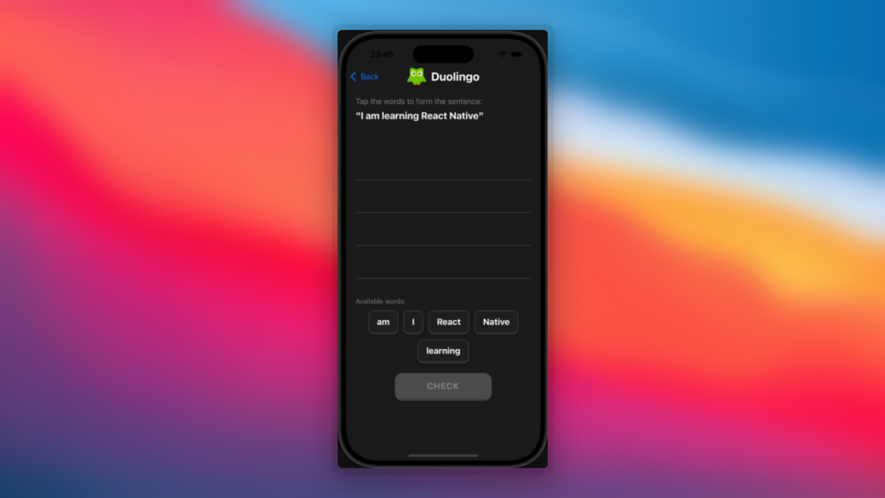

# Duolingo Drag Sort Words

This example demonstrates the drag-and-drop word sorting animation from the Duolingo app, where users arrange words to form a correct sentence.

## Features

- Drag words from the word bank to the drop area
- Tap words to quickly add/remove them from the drop area
- Word displacement when dragging over other words

## Implementation Details

The animation uses:

- `react-native-reanimated` for smooth, performant animations
- `react-native-gesture-handler` for pan and tap gestures
- Shared values for cross-thread communication between UI and JS threads

## Key Components

- `DraggableWord` - Individual word component with pan and tap gestures
- `DropArea` - Target area where words are arranged into sentences
- `DuoLingoDragSortWords` - Main component orchestrating the animation logic

## DEMO

